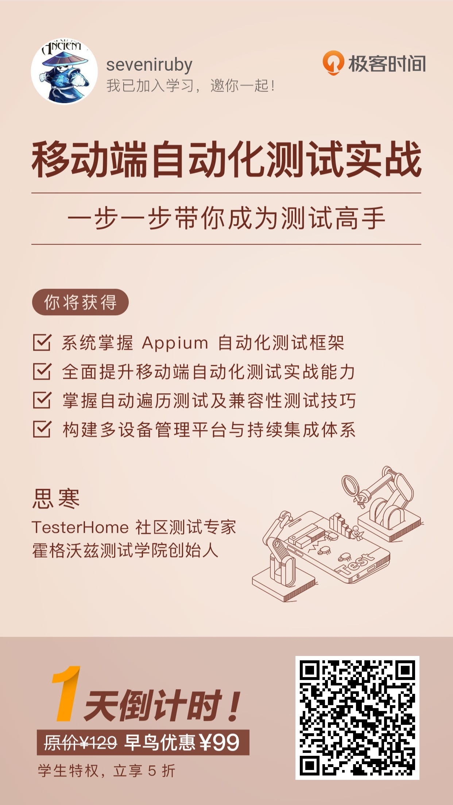

# Geek_AppAutomationTestingCode
本项目为[极客时间](time.geekbang.org)与[霍格沃兹测试学院](testerh.ke.qq.com)的思寒老师共同维护的App自动化测试课程的相关源代码。

## 移动端自动化测试课程

## 思寒介绍
- 霍格沃兹测试学院创始人
- 测吧（北京）科技有限公司首席测试架构师
- 测试行业从业十年以上，先后服务于阿里巴巴、百度等互联网公司
- GMTC、MTSC大会演讲嘉宾
- 开源自动化测试项目AppCrawler作者

## 参考文档
- [appium](appium.io)
- [appcrawler](https://github.com/seveniruby/AppCrawler)
- [极客时间app自动化测试专栏](https://time.geekbang.org/course/intro/100038001)
- [霍格沃兹测试学院](testerh.ke.qq.com)